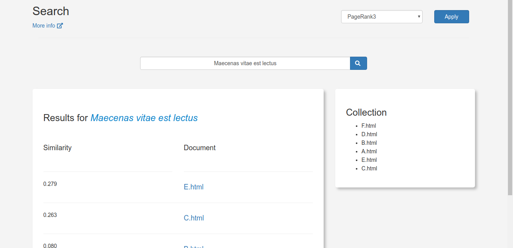
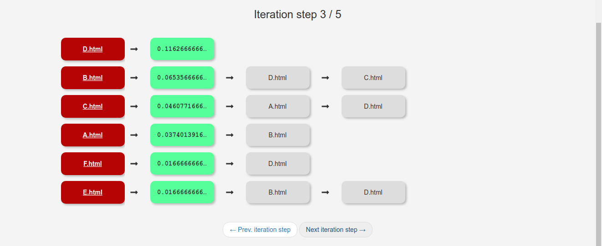

VIRS
===
**_Visualization and Information Retrieval System_**

Built with Django web framework and Docker.

## Getting started

##### Shell 1 - run containers
```bash
docker-compose up
```

##### Shell 2 - run interactive shell

```bash
docker-compose run web bash

# run migrations
./manage.py makemigrations
./manage.py migrate
```

##### Access localhost:8000

---

## Features

#### Start


#### Inverted Index


### Vector Space Model representation


### Collection Search


### PageRank result and visualization




## Other tasks

##### Finish
```bash
docker-compose down
```

##### Restart containers
```bash
docker-compose down
docker-compose up
```

##### Wipe database
```bash
docker-compose down
sudo mv .db/ .db.backup/
```

##### Running migrations
```bash
# with containers running, open an interactive shell with:
docker-compose run web bash

./manage.py makemigrations
./manage.py migrate
```

##### Create Django superuser
```bash
docker-compose run web bash
./manage.py createsuperuser
# login to admin dashboard at localhost:8000/admin
```

##### Rebuild
If Docker files or image change
```bash
docker-compose down
sudo mv .db/ .db.backup/
docker-compose build
docker-compose up
```

##### Set permissions for local user
```bash
pwd
# if at this project root, proceed with:
sudo chown $USER:$USER -R .
```
